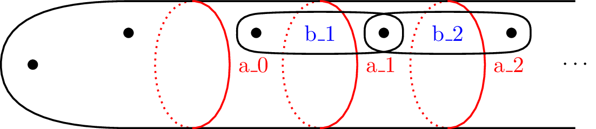
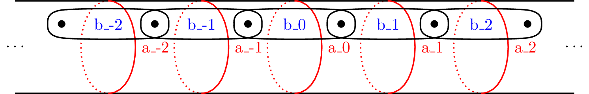
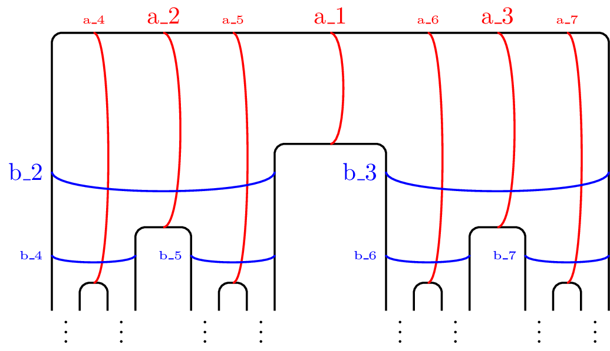
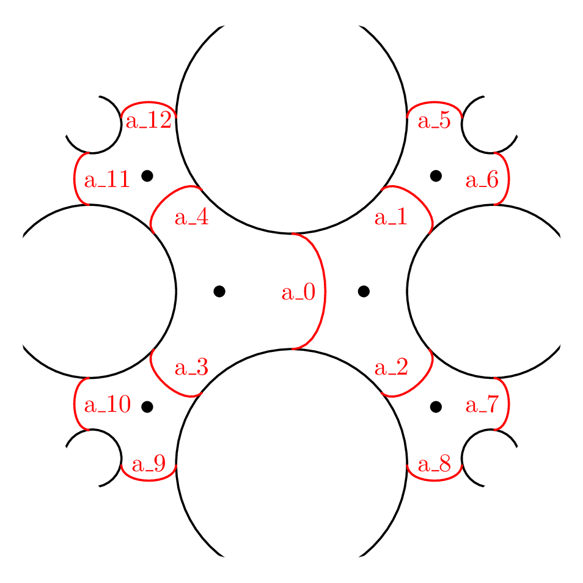
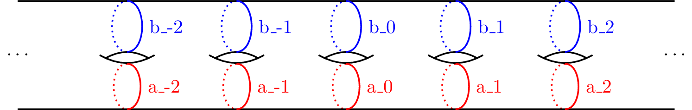

Surfaces
========

Bigger comes with a number of pre-made surfaces.
These available within :mod:`bigger.load`

Flute
-----

.. autofunction:: bigger.load.flute

Biflute
-------

.. autofunction:: bigger.load.biflute

Cantor
------

.. autofunction:: bigger.load.cantor

Spotted Cantor
--------------

.. autofunction:: bigger.load.spotted_cantor

Ladder
------

.. autofunction:: bigger.load.ladder

