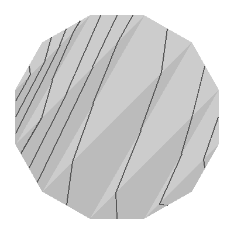
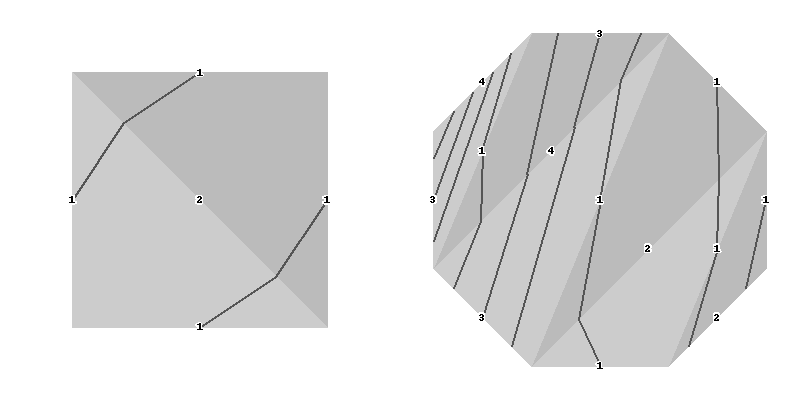
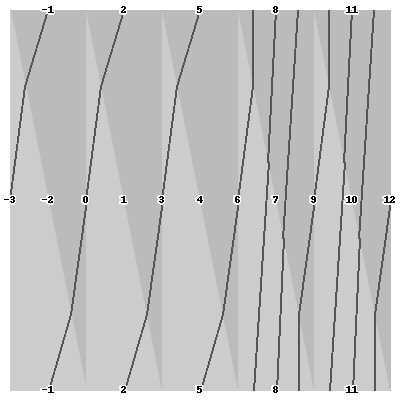

Walkthrough
===========

Eager to get started? This page gives a good introduction in how to get started with bigger.

First, make sure that:

    - bigger is installed
    - bigger is up-to-date

Let's get started with some simple examples.

Getting a mapping class group
-----------------------------

Begin by importing bigger::

    >>> import bigger

Now, let's use the :ref:`bigger.load.biflute <Biflute>` method to load a big mapping class group::

    >>> S = bigger.load.biflute()

This builds the :class:`mapping class group <bigger.mappingclassgroup.MappingClassGroup>` of the two-ended, infinitely-punctured surface of genus zero.

Laminations
-----------

A lamination is specified by a function that returns the number of times that it intersects each edge of the underlying triangulation.
As usual, if a lamination has :math:`k` components that are parallel to an edge then their intersection is :math:`-k`.
We can create a :class:`~bigger.lamination.Lamination` by giving a dictionary to the underlying triangulation of the mapping class group.
This dictionary maps some of the triangulations edges to the weight assigned to them by the lamination::

    >>> c = S.triangulation({1: -1})
    >>> c
    Lamination 1: -1
    >>> c(1), c(3), c(10000), c(-22)
    1, 0, 0, 0

Of course, many laminations do not have finite support and so cannot be specified this way.
More generally, we can pass a weight function to the mapping class groups underlying triangulations::

    >>> a = S.triangulation(lambda e: -1 if e >= 0 and e % 2 == 1 else 0)
    >>> a(0), a(1), a(2), a(3)
    (0, -1, 0, -1)
    >>> a
    Infinitely supported lamination 0: 0, -1: 0, 1: -1, -2: 0, 2: 0, -3: 0, 3: -1, -4: 0, 4: 0, -5: 0 ...

By default this assumes that the lamination is supported by all of the triangulation.
If we know better then we can also provide an iterator over the support of the lamination::

    >>> from itertools import count
    >>> a = S.triangulation(
    ... lambda e: -1 if e >= 0 and e % 2 == 1 else 0,
    ... support=lambda: (2*i + 1 for i in count()))
    >>> a
    Infinitely supported lamination 1: -1, 3: -1, 5: -1, 7: -1, 9: -1, 11: -1, 13: -1, 15: -1, 17: -1, 19: -1 ...

Mapping Classes
---------------

A mapping class group comes with a number of mapping classes.
We can build a :class:`mapping class <bigger.encoding.Encoding>` from these::

    >>> h = S('a_0.a_0')

We can compute the image of a lamination under a mapping class::

    >>> h(c)
    Lamination 1: 1, 2: 2

And, since these laminations have finite support and known, we can test whether two such laminations are equal::

    >>> S('a_1')(c) == c
    True

We can even compute the image of infinitely supported laminations::

    >>> h(a)
    Infinitely supported lamination 1: 1, 2: 2, 5: -1, 3: -1, 2: 2, 2: 2, 1: 1, 2: 2, 2: 2, 1: 1 ...

Of course, in this case we cannot tell whether two such laminations are equal (or even equal to themselves)::

    >>> a == a
    Traceback (most recent call last):
      File "<stdin>", line 1, in <module>
      File "/bigger/lamination.py", line 36, in __eq__
        raise ValueError("Can only determine equality between finitely supported laminations")
    ValueError: Can only determine equality between finitely supported laminations

Visualisations
--------------

It's often hard to visualise or keep track of what is going on on these surfaces.
To help with this, bigger can create pictures of laminations on parts of the surface::

    >>> L = S.triangulation(lambda edge: 1 if edge % 3 != 2 else 0)
    >>> L = S('a.a{n > 1}.a{n > 1}')(L)
    >>> L.draw([-2, -1, 0, 1, 2, 3, 4, 5, 6, 7, 8, 9, 10, 11])

This is a pillow Image object and so if you are running bigger within a jupyter notebook it will be automatically rendered in your browser.

If not then you may need to use its :meth:`show()` method to write the image to a temporary file and open it in your image viewer::

    >>> L.draw([-2, -1, 0, 1, 2, 3, 4, 5, 6, 7, 8, 9, 10, 11]).show()

As well as the collection of edges to draw the lamination around, the :meth:`~bigger.lamination.Lamination.draw` method supports a number of optional arguments.
This includes labels to place on the edges in the picture as well as the size of the image to produce::

    >>> L.draw([-2, -1, 3, 4, 5, 6, 7, 8, 9], label='weight', w=800)

Importantly, the mapping class group provides a standard way of laying out its underlying triangulation::

    >>> L.draw([-2, 0, 1, 3, 4, 6, 7, 9, 10], layout=S, label='edge')

Operations on mapping classes
-----------------------------

Bigger also allows us to compose together or take powers of existing mapping classes::

    >>> g = h * S('b_1')
    >>> g(c)
    Lamination 1: 2, 2: 3, 3: 1, 4: 2, 6: 2, 7: 1, 8: 1
    >>> (g**2)(c)
    Lamination 1: 5, 2: 6, 3: 3, 4: 4, 6: 4, 7: 2, 8: 2

Building new mapping classes
----------------------------

Since  it can manipulate curves, bigger can create the Dehn twist about a curve automatically::

    >>> twist = S.triangulation({1: 1, 2: 1}).encode_twist()
    >>> twist(c), (twist * twist)(c), (twist**3)(c)
    (Lamination 2: 1, Lamination 1: 1, 2: 2, Lamination 1: 2, 2: 3)
